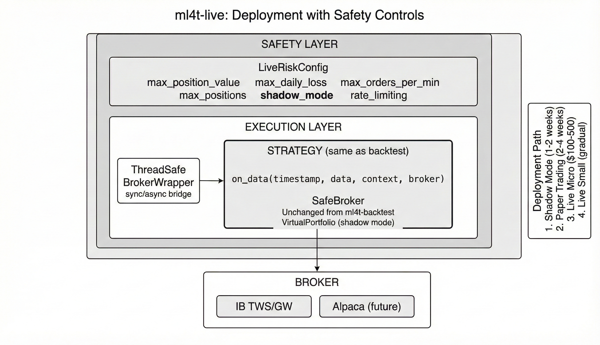

# ml4t-live

[](https://www.python.org/downloads/)
[](https://pypi.org/project/ml4t-live/)
[](https://opensource.org/licenses/MIT)

Live trading platform with zero-code migration from backtest to production.

## Part of the ML4T Library Ecosystem

This library is one of five interconnected libraries supporting the machine learning for trading workflow described in [Machine Learning for Trading](https://mlfortrading.io):


Each library addresses a distinct stage: data infrastructure, feature engineering, signal evaluation, strategy backtesting, and live deployment.

## What This Library Does

Deploying a backtested strategy to live markets requires careful handling of async broker connections, risk limits, and testing infrastructure. ml4t-live provides:

- The same Strategy class used in ml4t-backtest works unchanged
- Shadow mode for testing without placing real orders
- Position and order limits with rate limiting
- Interactive Brokers integration via TWS/Gateway
- Thread-safe bridging between sync strategies and async brokers

The goal is gradual deployment: shadow mode first, then paper trading, then live with small positions.



## Installation

```bash
pip install ml4t-live
```

## Quick Start

```python
from ml4t.backtest import Strategy, OrderSide
from ml4t.live import LiveEngine, LiveRiskConfig
from ml4t.live.brokers.ib import IBBroker
import asyncio

# Same strategy class from backtesting
class MyStrategy(Strategy):
    def on_data(self, timestamp, data, context, broker):
        if not broker.get_position('SPY'):
            broker.submit_order('SPY', 10, side=OrderSide.BUY)

async def main():
    broker = IBBroker(port=7497)  # Paper trading port
    await broker.connect()

    config = LiveRiskConfig(
        shadow_mode=True,           # No real orders
        max_position_value=50_000,
    )
    engine = LiveEngine(broker, MyStrategy(), config)

    try:
        await engine.run()
    finally:
        await broker.disconnect()

asyncio.run(main())
```

Shadow mode output:

```
Bar 1: SPY close = $450.02
  -> Buying 10 shares of SPY (VIRTUAL - shadow mode)
Virtual position: +10 SPY @ $450.02
No real orders placed (shadow mode active)
```

## Risk Configuration

```python
config = LiveRiskConfig(
    shadow_mode=True,               # Virtual orders only
    max_position_value=50_000,      # Per-position limit
    max_positions=10,               # Total positions
    max_order_value=10_000,         # Per-order limit
    max_orders_per_minute=10,       # Rate limiting
    max_daily_loss=5_000,           # Stop trading limit
)
```

## Broker Integration

### Interactive Brokers

```python
from ml4t.live.brokers.ib import IBBroker

broker = IBBroker(port=7497)  # TWS paper port
# broker = IBBroker(port=7496)  # TWS live port

await broker.connect()
print(f"Connected: {broker.is_connected}")
print(f"Account: {broker.account_id}")
```

Requirements:
- IB TWS or Gateway running
- API connections enabled in TWS settings
- Paper trading account for initial testing

## Deployment Progression

1. **Shadow Mode** (1-2 weeks): Verify logic without real orders
2. **Paper Trading** (2-4 weeks): Test with IB paper account
3. **Live Micro** (1-2 weeks): Small positions ($100-500)
4. **Live Small** (ongoing): Gradual size increase

## Strategy Compatibility

The same Strategy class works in both environments:

```python
from ml4t.backtest import Strategy

class MyStrategy(Strategy):
    def on_data(self, timestamp, data, context, broker):
        # This code runs identically in backtest and live
        pass

# Backtest
from ml4t.backtest import Engine
result = Engine(feed, MyStrategy(), config).run()

# Live
from ml4t.live import LiveEngine
await LiveEngine(broker, MyStrategy(), risk_config).run()
```

## Technical Characteristics

- **Async/sync bridge**: Sync strategy callbacks work with async broker connections
- **Thread-safe**: Safe to use across multiple event loops
- **Virtual portfolio**: Shadow mode tracks positions without broker interaction
- **Rate limiting**: Built-in protection against order flooding

## Related Libraries

- **ml4t-data**: Market data acquisition and storage
- **ml4t-engineer**: Feature engineering and technical indicators
- **ml4t-diagnostic**: Signal evaluation and statistical validation
- **ml4t-backtest**: Event-driven backtesting

## Development

```bash
git clone https://github.com/applied-ai/ml4t-live.git
cd ml4t-live
uv sync
uv run pytest tests/ -q
uv run ty check
```

## Safety Notice

This library is designed for paper trading and educational purposes. When transitioning to live trading:

- Always start with shadow_mode=True
- Set conservative position and order limits
- Monitor virtual vs real positions carefully
- Use stop-losses and position limits

## License

MIT License - see [LICENSE](LICENSE) for details.
