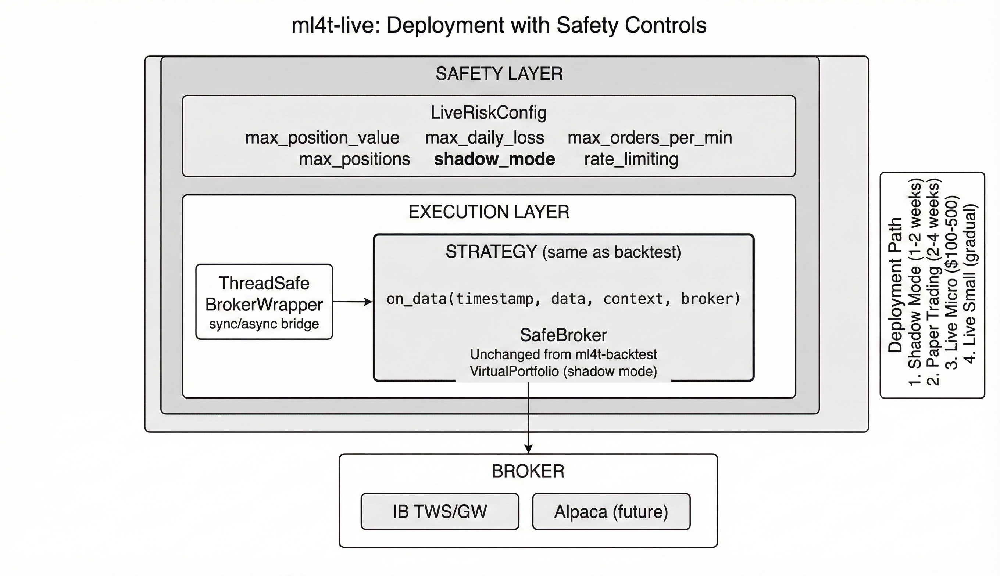

# ml4t-live

[](https://www.python.org/downloads/)
[](https://pypi.org/project/ml4t-live/)
[](https://opensource.org/licenses/MIT)

Live trading runtime for causal ML4T strategies.

## Part of the ML4T Library Ecosystem

This library is one of six interconnected libraries supporting the machine learning for trading workflow described in [Machine Learning for Trading](https://www.ml4trading.io/):


Together they cover data infrastructure, feature engineering, modeling, signal evaluation, strategy backtesting, and live deployment.

## What This Library Does

Deploying a backtested strategy to live markets requires careful handling of async broker connections, risk limits, and testing infrastructure. ml4t-live provides:

- Strategy portability under the shared lifecycle version 1 contract
- Two broker integrations: Interactive Brokers (TWS/Gateway) and Alpaca (stocks + crypto)
- A stable-supported OKX feed plus typed bar aggregation
- Explicit opt-in experimental adapters for Alpaca, IB, generic CCXT, and DataBento workflows
- Shadow mode for testing without placing real orders (VirtualPortfolio tracking)
- 16-parameter risk configuration: position limits, order limits, loss limits, price protection
- Kill switch with crash-safe state persistence (atomic JSON writes)
- Startup preflight, reconciliation, and JSONL execution journaling for operator workflows
- Async architecture with thread-safe sync bridge for strategy callbacks

The goal is gradual deployment: shadow mode first, then paper trading, then live with small positions.



## Installation

```bash
uv add ml4t-live
```

Add the optional DataBento SDK only for deliberate experimental evaluation:

```bash
uv add 'ml4t-live[experimental]'
```

## Quick Start

```python
from ml4t.backtest import Strategy, OrderSide
from ml4t.live import LiveEngine, LiveRiskConfig, SafeBroker
from ml4t.live.brokers.alpaca import AlpacaBroker
from ml4t.live.feeds.alpaca_feed import AlpacaDataFeed
import asyncio

# A lifecycle-v1 strategy that uses only portable callbacks and broker operations
class MyStrategy(Strategy):
    def on_data(self, timestamp, data, context, broker):
        if not broker.get_position('SPY'):
            broker.submit_order('SPY', 10, side=OrderSide.BUY)

async def main():
    broker = AlpacaBroker(api_key="...", secret_key="...", paper=True)
    feed = AlpacaDataFeed(
        api_key="...", secret_key="...", symbols=["SPY"], experimental=True
    )

    config = LiveRiskConfig(
        execution_mode="shadow",   # No real orders
        max_position_value=50_000,
    )
    safe = SafeBroker(broker, config)

    engine = LiveEngine(MyStrategy(), safe, feed)
    await engine.connect()

    try:
        await engine.run()
    finally:
        await engine.stop()

asyncio.run(main())
```

## Broker Integrations

### Alpaca

Stocks and crypto with paper trading by default:

```python
from ml4t.live.brokers.alpaca import AlpacaBroker

broker = AlpacaBroker(
    api_key="...",
    secret_key="...",
    paper=True,       # Paper trading (default)
)
await broker.connect()
```

### Interactive Brokers

Full market access via TWS or IB Gateway:

```python
from ml4t.live.brokers.ib import IBBroker

broker = IBBroker(port=7497)  # TWS paper port
# broker = IBBroker(port=7496)  # TWS live port

await broker.connect()
print(f"Connected: {broker.is_connected}")
```

Requirements:
- IB TWS or Gateway running
- API connections enabled in TWS settings
- Paper trading account for initial testing

## Data Feeds

| Feed | Source | Status | Coverage |
|------|--------|--------|----------|
| `AlpacaDataFeed` | Alpaca | experimental | US stocks + crypto, real-time bars/quotes/trades |
| `IBDataFeed` | Interactive Brokers | experimental | Multi-asset tick-by-tick data |
| `OKXFundingFeed` | OKX | stable-supported | Perpetual swaps with funding rates |
| `BarAggregator` | Any typed feed | stable-supported | Multi-feed aggregation + bar assembly |
| `DataBentoFeed` | DataBento | experimental | Historical replay + real-time streaming |
| `CryptoFeed` | CCXT | experimental | Generic exchange trades and candles |

```python
from ml4t.live.feeds.alpaca_feed import AlpacaDataFeed
from ml4t.live.feeds.crypto_feed import CryptoFeed

# Experimental stock + crypto feed via Alpaca
feed = AlpacaDataFeed(
    api_key="...", secret_key="...",
    symbols=["AAPL", "BTC/USD"],
    feed="iex",          # "iex" (free) or "sip" (premium)
    experimental=True,
)

# Experimental generic crypto adapter; not part of the stable support contract
feed = CryptoFeed(
    exchange="binance",
    symbols=["BTC/USDT", "ETH/USDT"],
    timeframe="1m",
    experimental=True,
)
```

The experimental adapters require explicit opt-in and report their adapter-specific missing
guarantees on first use. The `experimental` package extra installs the DataBento SDK; the other
adapters are present in the default environment.

## Risk Configuration

`LiveRiskConfig` controls all safety parameters. Wrap any broker with `SafeBroker` to enforce them:

```python
from ml4t.live import LiveRiskConfig, SafeBroker

config = LiveRiskConfig(
    # Explicit execution routing
    execution_mode="shadow",           # Virtual orders only (no real execution)

    # Position limits
    max_position_value=50_000,          # Max $ per position
    max_position_shares=1000,           # Max shares per position
    max_total_exposure=200_000,         # Max total $ across all positions
    max_positions=20,                   # Max number of positions

    # Order limits
    max_order_value=10_000,             # Max $ per order
    max_order_shares=500,               # Max shares per order
    max_orders_per_minute=10,           # Rate limiting

    # Loss limits
    max_daily_loss=5_000,               # Stop trading if exceeded
    max_drawdown_pct=0.05,              # Stop if 5% drawdown

    # Price protection
    max_price_deviation_pct=0.05,       # Fat finger: reject if >5% from market
    max_data_staleness_seconds=60,      # Reject if data older than 60s
    dedup_window_seconds=1.0,           # Block duplicate orders within 1s

    # Asset restrictions
    allowed_assets={"SPY", "QQQ"},      # Whitelist (empty = allow all)

    # Startup and persistence
    fail_on_reconciliation_mismatch=True,
    journal_file=".ml4t_execution_journal.jsonl",
)

safe_broker = SafeBroker(broker, config)
```

Use `None` to disable an individual numeric limit. NaN and infinity are invalid. Order quantities
are signed only when `side` is omitted; an explicit side requires a positive unsigned quantity.

## Safety System

### Kill Switch

When drawdown exceeds `max_drawdown_pct`, the kill switch activates and blocks all new orders. The state persists across process restarts:

```python
config = LiveRiskConfig(
    kill_switch_enabled=True,
    max_drawdown_pct=0.05,
    state_file=".ml4t_risk_state.json",  # Atomic JSON writes
)
```

### Virtual Portfolio

Shadow mode tracks positions internally without broker interaction:

```python
from ml4t.live import VirtualPortfolio

portfolio = VirtualPortfolio(initial_cash=100_000)
# SafeBroker uses this automatically when shadow_mode=True
```

### State Persistence

Risk state survives process crashes through a versioned, checksummed atomic file:

- `daily_loss` - Cumulative daily loss
- `orders_placed` - Orders placed today
- `high_water_mark` - Session high equity
- `kill_switch_activated` - Persists until manually reset

State and audit files use mode `0600`, reject unsafe ownership or symlinks, and permit one writer.
`SafeBroker` also writes a hash-chained JSONL execution journal with reconciliation, order,
kill-switch, and runtime health events. Audit failure blocks broker calls by default.

`LiveEngine` acquires the broker and feed transactionally. Startup failure, strategy failure,
cancellation, and normal completion release acquired resources in reverse order. Bounded recovery
does not repeat strategy startup callbacks; exhausted recovery and incomplete cleanup have distinct
public exceptions and a `failed` runtime state.

## Operator CLI

Use the CLI as a thin operator surface around the Python API:

```bash
# Fail-fast startup check for a real broker session
uv run ml4t-live preflight ib --state-file .ml4t_risk_state.json --strict

# Human-readable state and recent journal tail
uv run ml4t-live status --state-file .ml4t_risk_state.json

# Bounded shadow soak
uv run ml4t-live shadow examples/shadow_mode_demo.py --feed okx --duration 60
```

`preflight` is the operator readiness command: it checks broker reachability, balances, persisted
kill-switch state, startup reconciliation, and session state, and exits non-zero when the result is
degraded.

## Order Lifecycle

Strategies still place orders through the same synchronous wrapper interface, but pending orders can now be replaced in a normalized way:

```python
def on_data(self, timestamp, data, context, broker):
    if broker.pending_orders:
        broker.replace_order(broker.pending_orders[0].order_id, limit_price=189.5)
```

The default implementation uses a safe cancel-and-resubmit flow across supported brokers.

## Deployment Progression

1. **Shadow Mode** (1-2 weeks): Verify logic without real orders
2. **Paper Trading** (2-4 weeks): Test with paper account
3. **Live Micro** (1-2 weeks): Small positions ($100-500)
4. **Live Small** (ongoing): Gradual size increase

## Strategy Portability

A `Strategy` subclass can run in both environments when it satisfies lifecycle version 1 and uses
only the portable broker surface. Portability covers callback order and canonical strategy intent.
It does not make venue fills, latency, data subscriptions, risk decisions, or account state equal.

```python
from ml4t.backtest import Strategy

class MyStrategy(Strategy):
    def on_data(self, timestamp, data, context, broker):
        # Portable decision logic; execution outcomes remain runtime-specific.
        pass

# Backtest
from ml4t.backtest import Engine
result = Engine(feed, MyStrategy(), config).run()

# Live
from ml4t.live import LiveEngine
await LiveEngine(MyStrategy(), safe_broker, live_feed).run()
```

See the [portability contract](docs/user-guide/backtest-to-live.md) and
[migration guide](docs/user-guide/migration.md) before moving an existing strategy.

## Documentation

- [Installation](docs/getting-started/installation.md) - setup instructions
- [Quick Start](docs/getting-started/quickstart.md) - first live strategy
- [Brokers](docs/user-guide/brokers.md) - IB and Alpaca setup
- [Data Feeds](docs/user-guide/feeds.md) - supported and experimental feed contracts
- [Risk Management](docs/user-guide/risk.md) - LiveRiskConfig and SafeBroker
- [Candidate Qualification](docs/qualification.md) - validate an exact candidate without release

## Stable Support Boundary

The stable candidate supports Linux with Python 3.12, 3.13, and 3.14. CI, wheel, and source
distribution qualification cover those interpreter versions. Windows, macOS, and Python 3.15 are
not part of this stable contract. IB and Alpaca broker adapters and the OKX feed are supported only
within the documented capabilities, reconciliation, causal-event, overload, and paper-account
boundaries. Alpaca, IB, DataBento, and generic CCXT feeds require explicit experimental opt-in.

## Technical Characteristics

- **Versioned lifecycle**: `on_start`, `on_prepare`, `on_data`, and `on_end` follow the
  negotiated shared lifecycle contract
- **Async/sync bridge**: All synchronous strategy callbacks run on one dedicated worker thread;
  broker I/O stays on the async event loop without event-loop re-entry
- **Exception behavior**: Strategy exceptions abort the run, invoke `on_end` once after a
  successful run start, and are reraised after cleanup
- **Protocol-based**: `BrokerProtocol`, `AsyncBrokerProtocol`, `DataFeedProtocol` for extensibility
- **Virtual portfolio**: Shadow mode tracks positions without broker interaction
- **Atomic state**: Risk state persisted via POSIX-atomic file writes (crash-safe)
- **Rate limiting**: Built-in protection against order flooding
- **Type-safe**: Full type annotations throughout

## Related Libraries

- **ml4t-data**: Market data acquisition and storage
- **ml4t-engineer**: Feature engineering and technical indicators
- **ml4t-diagnostic**: Signal evaluation and statistical validation
- **ml4t-backtest**: Event-driven backtesting

## Development

```bash
git clone https://github.com/ml4t/live.git
cd ml4t-live
uv sync --all-extras --dev
uv run python scripts/qualification/run_beta_gate.py
```

## Safety Notice

This library is designed for paper trading and educational purposes. When transitioning to live trading:

- Always start with `execution_mode="shadow"`
- Set conservative position and order limits
- Enable `kill_switch_enabled=True` with a reasonable `max_drawdown_pct`
- Monitor virtual vs real positions carefully
- Use the deployment progression above

## License

MIT License - see [LICENSE](LICENSE) for details.
